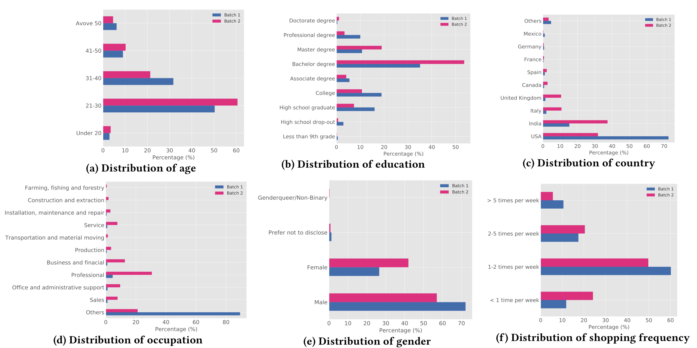
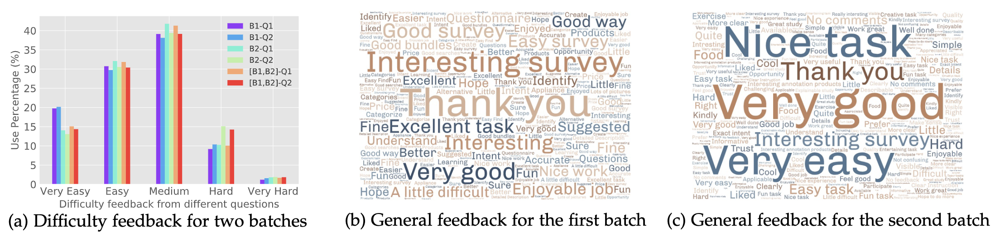

# Bundle Recommendation
This project aims to provide new data sources for product bundling in real e-commerce platforms with the domains of Electronic, Clothing and Food. We construct three high-quality bundle datasets with rich meta information, particularly bundle intents, through a carefully designed crowd-sourcing task.

### 1. Worker Basic Information
Figure 1 shows the distribution of workers' age, education, country, occupation, gender and shopping frequency for the two batches. In particular, `Others' in the country distribution includes Argentina, Australia, Anguilla, Netherlands, Albania, Georgia, Tunisia, Belgium, Armenia, Guinea, Austria, Switzerland, Iceland, Lithuania, Egypt, Venezuela, Bangladesh, American Samoa, Vanuatu, Colombia, United Arab Emirates, Ashmore and Cartier Island, Estados Unidos, Wales, Turkey, Angola, Scotland, Philippines, Iran and Bahamas.

Figure 1: Worker basic information in the first and second batches.

### 2. Feedback from Workers
Figure 2 visualizes worker feedback towards our task, where (a) shows the feedback regarding the difficulty on identifying bundles and naming the corresponding intents for the two batches; and (b-c) depict the general feedback for the two batches.

  

Figure 2: Feedback from workers for the two batches.

### 3. Parameter Tuning and Settings for Bundle Detection
A grid search in {0.0001, 0.001, 0.01} is applied to find out the optimal settings for *support* and *confidence*, and both are set as 0.001 across the three domains.

### 4. Parameter Tuning and Settings for Bundle Completion
The dimension *d* of item and bundle representations for all methods is 20. Grid search is adopted to find out the best settings for other key parameters. In particular, learning rate   and regularization coefficient   are searched in {0.0001, 0.001, 0.01}; the number of neighbors *K* in ItemKNN is searched in {10, 20, 30, 50}; the weight of KL divergence  in VAE is searched in {0.001, 0.01, 0.1}; and the batch size is searched in {64, 128, 256}. The optimal parameter settings are shown in Table 1. 

&emsp;&emsp;&emsp;&emsp;&emsp;&emsp;&emsp;&emsp;Table 1: Parameter settings for bundle completion (*d=20*).

|  | Electronic | Clothing | Food |
| :------: | :------: | :------: | :------: |
| ItemKNN | |  |  |
| BPRMF |     |     |     |
| mean-VAE |       |       |       |
| concat-VAE |       |       |       |

### 5. Parameter Tuning and Settings for Bundle Ranking
The dimension *d* of representations is set as 20. We apply a same grid search for , ,  and batch size as in bundle completion. Besides, the predictive layer *D* for AttList is searched from {20, 50, 100}; the node and message dropout rate for GCN and BGCN is searched in {0, 0.1, 0.3, 0.5}. As the training complexity for GCN and BGCN is quite high, we set the batch size as 2048 as suggested by the original paper. The optimal parameter settings are presented in Table 2. Note that the parameter settings for BGCN is the version without pre-training (i.e. ). 

&emsp;&emsp;&emsp;&emsp;&emsp;&emsp;&emsp;Table 2: Parameter settings for bundle ranking (*d=20*).

|  | Electronic | Clothing | Food |
| :------: | :------: | :------: | :------: |
| ItemKNN | |  |  |
| BPRMF |     |     |     |
| DAM |    |    |    |
| AttList |        |        |        |
| GCN |        |        |        |
| BGCN |        |        |        |

### 6. Parameter Tuning and Settings for Bundle Generation Explanation
For LSTM, BiLSTM and Transformer, the dimension of word embeddings is 300; learning rate  is searched in {0.0001, 0.001, 0.01}; batch size is searched in {16, 32, 64};  the hidden size is searched in {128, 256, 512}; the number of heads (i.e., *n_heads*) for Transformer is searched in the range of [1, 8] stepped by 1; the number of encoder/decoder layers is searched in {1, 2, 3, 4}. For the pre-trained models, i.e., BertGeneration, BART-base and T5-base, the maximum length in encoder is set to 512, and the maximum length in decoder is set to 64; learning rate  is searched in {0.00002, 0.00005, 0.00007, 0.0001}; the number of epochs is searched in {3, 4, 5}. The optimal parameter settings are shown in Table 3. 

&emsp;&emsp;Table 3: Parameter settings for bundle generation explanation.

|  | Optimal Parameter Settings|
| :------: | :------: | 
| LSTM |  | 
| BiLSTM |   |
| Transformer|   | 
| BertGeneration | | 
| BART-base | | 
| T5-base | | 

### 7. Parameter Tuning and Settings for Bundle Ranking Explanation
For RM, we apply a grid search in {0.0001, 0.001, 0.01, 0.1} for *support* and *confidence*; and a grid search in {1, 2, 3, 4} for *lift* to find out their optimal settings. For EFM, the regularization coefficients  and  are searched in the range of (0, 1] with a step of 0.1, while ,  and  are searched in {0.0001, 0.001, 0.01, 0.1}; the total number of factors *r* is searched from {20, 50, 100}; the ratio of explicit factors  is searched in a range of [0, 1] with a step of 0.1; the number of most cared features *k* in searched from [10, 100] with a step of 10. For PGPR and KGAT, we apply the same grid search for , batch size, the node and message dropout rate as in bundle ranking; the dimension of representations (*d*) is searched in {20, 50, 100}; the action space and the weight of entropy loss for PGPR are searched in {100, 200, 300} and {0.0001, 0.001, 0.01}, respectively; the sampling sizes at the 3 steps (i.e., ) for PGPR are searched in {20, 25, 30}, {5, 10, 15} and {1}, respectively; and the regularization coefficient  for KGAT is searched from {0.0001, 0.001, 0.01, 0.1}. The optimal parameter settings are shown in Table 4. 

&emsp;&emsp;&emsp;&emsp;&emsp;&emsp;&emsp;&emsp;&emsp;&emsp;&emsp;&emsp;Table 4: Parameter settings for bundle ranking explanation.

|  | Electronic | Clothing | Food |
| :------: | :------: | :------: | :------: |
| RM |    |    |    |
| EFM |      |      |      |
| PGPR |        |         |         |
| KGAT |       |       |       |

### 8. Parameter Tuning and Settings for Bundle Auto-Naming
For the ImageCap model, the maximum length in decoder is set to 64; learning rate  is searched in {0.00002, 0.00005, 0.00007, 0.0001}; the number of epochs is searched in {3, 4, 5}. The optimal parameter settings are shown in Table 5. 

&emsp;&emsp;Table 5: Parameter settings for bundle generation explanation.

|  | Optimal Parameter Settings|
| :------: | :------: | 
| ImageCap | | 

### 9. Statistics of Datasets

&emsp;&emsp;&emsp;&emsp;&emsp;&emsp;&emsp;&emsp;Table 6: Statistics of datasets.

|      | Electronic | Clothing | Food |
|:------|:------------:|:----------:|:------:|
| #Users |    888   |   965    | 879  |
| #Items |    3499  |   4487   | 3767 |
| #Sessions | 1145  |   1181   | 1161 |
| #Bundles | 1750 | 1910 | 1784 |
| #Intents | 1422 | 1466 | 1156 |
| Average Bundle Size | 3.52 | 3.31 | 3.58 |
| #User-Item Interactions | 6165 | 6326 | 6395 |
| #User-Bundle Interactions | 1753 | 1912 | 1785 |
| Density of User-Item Interactions | 0.20% | 0.15% | 0.19% |
| Density of User-Bundle Interactions | 0.11% | 0.10% | 0.11% |

### 10. Descriptions of Data Files
Under the 'dataset' folder, there are three domains, including clothing, electronic and food. Each domain contains the following 9 data files.

Table 7: The descriptions of the data files.

| File Name | Descriptions |
|-----------|--------------|
| user_item_pretrain.csv| This file contains the user-item interactions aiming to obtain the pre-trained item representations via BPRMF for model initialization.  This is a tab separated list with 3 columns: `user ID \| item ID \| timestamp \|`<!-- The user IDs are the ones used in the `user_bundle.csv` and `user_item.csv` data sets. The item IDs are the ones used in the `user_item.csv`, `session_item.csv` and `item_categories.csv` data sets.-->|
| user_item.csv | This file contains the user-item interactions.  This is a tab separated list with 3 columns: `user ID \| item ID \| timestamp \|`  |
| session_item.csv | This file contains sessions and their associated items. Each session has at least 2 items.  This is a tab separated list with 2 columns: `session ID \| item ID \|` <!-- The session IDs are the ones used in the `session_bundle.csv` and `user_session.csv` data sets.-->  |
| user_session.csv| This file contains users and their associated sessions.  This is a tab separated list with 3 columns: `user ID \| session ID \| timestamp \|`  |
| session_bundle.csv| This file contains sessions and their detected bundles. Each session has at least 1 bundle.  This is a tab separated list with 2 columns: `session ID \| bundle ID \|` <!-- The bundle IDs are the ones used in the `bundle_item.csv` ,`user_bundle.csv` and `bundle_intent.csv` data sets.-->  The session ID contained in the session_item.csv but not in session_bundle.csv indicates there is no bundle detected in this session. |
| bundle_intent.csv | This file contains bundles and their annotated intents.  This is a tab separated list with 2 columns: `bundle ID \| intent \|`  |
| bundle_item.csv | This file contains bundles and their associated items. Each bundle has at least 2 items.  This is a tab separated list with 2 columns: `bundle ID \| item ID \|` |
| user_bundle.csv | This file contains the user-bundle interactions.  This is a tab separated list with 3 columns: `user ID \| bundle ID \| timestamp \|`  |
| item_categories.csv| This file contains items and their affiliated categories.  This is a tab separated list with 2 columns: `item ID \| categories \|`    The format of data in `categories` column is a list of string. |
| item_idx_mapping.csv| This file contains items and their source ID in Amazon datasets.  This is a tab separated list with 2 columns: `item ID \| source ID \|`  |
| user_idx_mapping.csv| This file contains users and their source ID in Amazon datasets.  This is a tab separated list with 2 columns: `user ID \| source ID \|`  |

### Acknowledgements

Our datasets are constructed on the basis of Amazon datasets (http://jmcauley.ucsd.edu/data/amazon/links.html).

All pre-trained models in bundle generation explanation are implemented based on Hugging Face (https://huggingface.co/).
